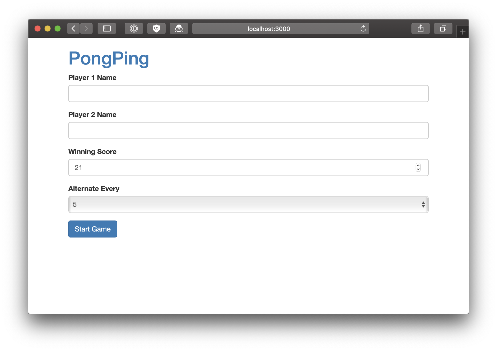

# React Redux

**Use Git to make a commit every time you get an answer working. Use sensible commit messages. This will give you the confidence to try things without worrying about getting back to a working state.**

**Keep Redux dev tools and the console open at all times.** Use Redux dev tools to check that actions have the correct payload and that the state is being updated as you expect. You shouldn't need to use `console.log()` for debugging.

## PongPing

- Update your PongPing app to dispatch actions from a container component using `connect`.

- Before the game starts users should be able to submit a name for each player, be able to chose a winning score (should default to `21`), and change how often to alternate the serve (should default to `5`). When the "Reset" button is pressed it should take you back to this screen to start a new game and show the previously entered values.

    - To start with, just create a form component with four controlled inputs
    - It should always go to alternating every two serves when you get to a deuce situation
    - You don't need to use ReactRouter, as it wouldn't make sense to go to the scoring part of the app *unless* the user has entered in the information.
    - Remember, `App.js` is just a React component like any other

